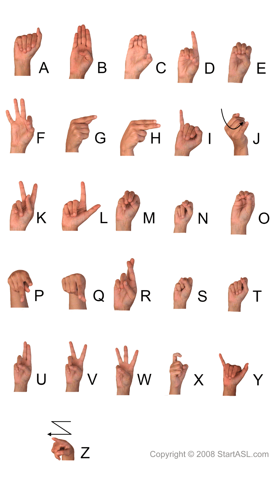

# Sign Lang

American Sign Language (ASL) is a complete, natural language that has the same linguistic properties as spoken languages, with grammar that differs from English. This project is intent to capture the letters or numbers from stream images with power of the artificial intelligence.



## Installation

Use the package manager [pip](https://pip.pypa.io/en/stable/) to install all the necessary packages.
Python (>3.7) supported.

First, please download the git files.

```bash
git clone https://github.com/H-steven/sign_lang.git
```

Second, install all the required packages with pip.

```bash
cd sign_lang
pip install -r requirements.txt
```

## Usage

try the demos and have fun. :)

```python
python app.py
```

To obtain ground truth data, we have manually annotated ~30K real-world images with 21 3D coordinates, as shown below (we take Z-value from image depth map, if it exists per corresponding coordinate). Here is the hand landmarks.


## Debug

If see the error `no display name and no $DISPLAY environment variable`, 
please use this commands in your shell.

```shell
export DISPLAY=:0
```

## License

This is a private github repository. Please contact the author to get the authorization.

[MIT](https://choosealicense.com/licenses/mit/)
